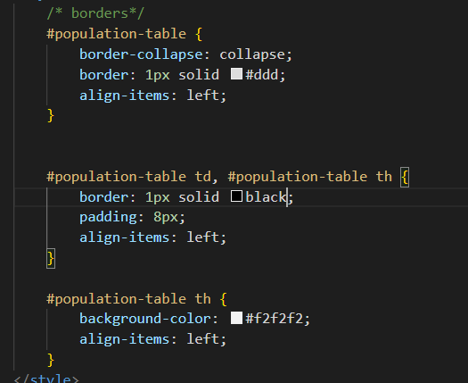

# POPULATION TABLE DATA PARSER!!!!!
## this file-
- fetches data from an open population API

- sorts the data that it fetches (ASCENDING)

- formats the population (using javascript's built in formatter)
- puts it in a table

- displays the table

- brings good fortune to you and your family (?)
## table styling
